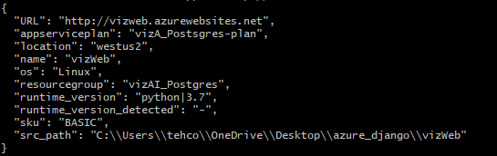

# vizAI - Visualising Explainable AI


## Deployment Manual

### Prerequisites

* Git
* Python 3.6+(ideally **3.7**)
* Django 3.0+(ideally **3.1**)
* PostgreSQL 12.6+ (ideally*13.2**)
* Microsoft Azure 2.18.0+ (**CLI-only**)
* djangorestframework 3.12.4 (**dev-only**)
* djangorestframework 1.0.0 (**dev-only**)

[Optional] This tutorial shows how to deploy vizAI web app to Azure App Service and connect it to an Azure Database for Postgres database. 
App Service provides a highly scalable, self-patching web hosting service.

In this tutorial, you use the Azure CLI to complete the following tasks:

 - [x]  Set up your initial environment with Python and the Azure CLI
 - [x]  Create an Azure Database for PostgreSQL database
 - [x]  Deploy code to Azure App Service and connect to PostgreSQL
 - [x]  Update your code and redeploy
 - [x]  View diagnostic logs
 - [x]  Manage the web app in the Azure portal


### General Installation

```zsh
$ git clone https://github.com/deCourier/vizAI.git
$ cd vizAI
$ pip install -r requirements.txt
$ pip install djangorestframework(dev-only)
$ pip install --upgrade sentry-sdk (dev-only)
```

#### Local Installation

**Build First**

```zsh
$ python manage.py makemigrations
$ python manage.py migrate
$ python manage.py runserver
```

This step compiles your code, migrates all the intended model files, check the data base files for any changes and finally runs the server on local host.
The web application will be run locally on local host port 8000.

### Live Installation

#### 1. Set up your initial environment

   1. Have an Azure account with an active subscription. Create an account for free.
   2. Install Python 3.6 or higher.
   3. Install the [Azure CLI 2.18.0](https://docs.microsoft.com/en-us/cli/azure/install-azure-cli) or higher, with which you run commands in any shell to provision and configure Azure resources.

Check that your Azure CLI version is 2.18.0 or higher:

```zsh
$ az --version
$ az login
```
If you need to upgrade, try the az upgrade command (requires version 2.11+) or see Install the Azure CLI.

```zsh

```
#### 2. Create Postgres databsae with Azure

Install the db-up extension for the Azure CLI:

```zsh
$ az extension add --name db-up
az postgres up --resource-group vizAI_RG --location westus2 --sku-name B_Gen5_1 --server-name <postgres-server-name> --database-name pollsdb --admin-user <admin-username> --admin-password <admin-password> --ssl-enforcement Enabled
```
##Note:##
Replace *<postgres-server-name>* with a name that's unique across all Azure (the server endpoint becomes *https://<postgres-server-name>.postgres.database.azure.com*). 
For *<admin-username>* and *<admin-password>*, specify credentials to create an administrator user for this Postgres server. The password must contain **8 to 128 characters** from three of the following categories: English uppercase letters, English lowercase letters, numbers (0 through 9), and non-alphanumeric characters (for example, !, #, %).

This command performs the following actions, which may take a few minutes:

  *  Create a resource group called DjangoPostgres-tutorial-rg, if it doesn't already exist.
  *  Create a Postgres server named by the --server-name argument.
  *  Create an administrator account using the --admin-user and --admin-password arguments. You can omit these arguments to allow the command to generate unique credentials for you.
  *  Create a pollsdb database as named by the --database-name argument.
  *  Enable access from your local IP address.
  *  Enable access from Azure services.
  *  Create a database user with access to the pollsdb database.
  
#### 3. Create the App Service App

Create an App Service app (the host process) with the az webapp up command:

```zsh
$ az webapp up --resource-group vizAI_RG --location westus2 --plan vizAI_plan --sku B1 --name <app-name>
```
##Note:##
Replace <app-name> with a unique name across all Azure (the server endpoint is https://<app-name>.azurewebsites.net).
This command performs the following actions, which may take a few minutes:

  * Create the resource group if it doesn't already exist. (In this command you use the same resource group in which you created the database earlier.)
  * Create the App Service plan DjangoPostgres-tutorial-plan in the Basic pricing tier (B1), if it doesn't exist. --plan and --sku are optional.
  * Create the App Service app if it doesn't exist.
  * Enable default logging for the app, if not already enabled.
  * Upload the repository using ZIP deployment with build automation enabled.
  * Cache common parameters, such as the name of the resource group and App Service plan, into the file .azure/config. As a result, you don't need to specify all the same parameter with later commands. For example, to redeploy the app after making changes, you can just run az webapp up again without any parameters. Commands that come from CLI extensions, such as az postgres up, however, do not at present use the cache, which is why you needed to specify the resource group and location here with the initial use of az webapp up.

Upon successful deployment, the command generates JSON output like the following example:


#### 3.2 Configure venv to connect to database

With the code now deployed to App Service, the next step is to connect the app to the Postgres database in Azure.

The app code expects to find database information in four environment variables named DBHOST, DBNAME, DBUSER, and DBPASS.

```zsh
$ az webapp config appsettings set --settings DBHOST="<postgres-server-name>" DBNAME="pollsdb" DBUSER="<username>" DBPASS="<password>"
```

Replace *<postgres-server-name>* with the name you used earlier with the az postgres up command. The code in azuresite/production.py automatically appends .postgres.database.azure.com to create the full Postgres server URL.
Replace *<username>* and *<password>* with the administrator credentials that you used with the earlier az postgres up command, or those that az postgres up generated for you. The code in azuresite/production.py automatically constructs the full Postgres username from DBUSER and DBHOST, so don't include the @server portion.
The resource group and app names are drawn from the cached values in the .azure/config file.

#### 3.3 Run Django database migrations

Open an SSH session in the browser at *https://<app-name>.scm.azurewebsites.net/webssh/host* by navigating to the following URL and signing in with your Azure account credentials (not the database server credentials)

Replace <app-name> with the name used earlier in the az webapp up command.
##Note:## If you cannot connect to the SSH session, then the app itself has failed to start. Check the diagnostic logs for details. For example, if you haven't created the necessary app settings in the previous section, the logs will indicate KeyError: 'DBNAME'.
In the SSH session, run the following commands (you can paste commands using Ctrl+Shift+V):

```zsh
# Activate the venv
$ source /antenv/bin/activate
$ pip install -r requirements.txt
$ python manage.py migrate
# Create the super user (follow prompts)
$ python manage.py createsuperuser
$ python manage.py runserver
```

The application should be deployed on *https://<app-name>.azurewebsites.net * now.
**Note:** If you encounter any errors related to connecting to the database, check the values of the application settings created in the previous section.

#### 4 (Optional)Redeploy Code to Azure

In case you want to redeploy your edited code based on our project on GitHub, you can! I have setup a GitHub Actions .yml to automatically run, build, and test redeployed code under build-and-deploy so as to facilitate better CI/CD operations.
After the job passes, you can redeploy the web app on azure by using the following command:
```zsh
$ az webapp up
```
This command uses the parameter cached in the .azure/config file. It allows you to redeploy your newly committed application, afterwards you need to redeploy your web app on the SSH browser! Just follow step 3.3 onwards again.

#### 5. (Optional) Stream diagnostic logs
You can access the console logs generated from inside the container that hosts the app on Azure.

Run the following Azure CLI command to see the log stream. This command uses parameters cached in the .azure/config file.
```zsh
$ az webapp up
```
