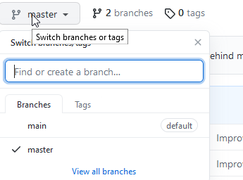

# vizAI

Visualising Explainable AI - A novelty project for non-data science people to get acquainted with Machine Learning.
This project contains 2 branches, the main branch for the SHAP Explainability Module, and the master branch for setting up the web application and deploying it on Azure. 

## Summary

  - [Getting Started](#getting-started)
  - [Running the tests](#running-the-tests)
  - [Built With](#built-with)
  - [Contributing](#contributing)
  - [Authors](#authors)
  - [License](#license)
  - [Acknowledgments](#acknowledgments)

## Getting Started

These instructions will get you a copy of the project up and running on
your local machine for development and testing purposes. If you wish to
just use our project, check out the project website. Read through the 
information.txt file for help on using the website.

### Prerequisites and Installing

To install the website and set it up on your own system, check out the redeployment guide.

## Running the tests

Download the model.pkl, x_train.pkl, x_test.pkl, y_train.pkl, y_test.pkl files from one of the Final Test Data examples.
Upload the files to the website where they are asked for and click "Generate Explanation Graphs"

## Built With

  - [Django](https://www.djangoproject.com/) - Used
    for the Code of Conduct
  - [Azure Machine Learning](https://ml.azure.com/) - Used to choose
    the license
  - [Interpret-Community SDK](https://github.com/interpretml/interpret-community) - Used
    for the explanations

## Contributing

Please read [CONTRIBUTING.md](CONTRIBUTING.md) for details on our code
of conduct, and the process for submitting pull requests to us.

## Authors

  - **Dylan Hoi** - *UI Designer, Researcher, Tester* -
    [deCourier](https://github.com/deCourier)
  - **Julian Popovski** - *Team Leader, Project Partner Liaison, Programmer* -
    [JulianPJ](https://github.com/JulianPJ)
  - **James Chang** - *Report Editor, Researcher, Tester* -
    [JamesC587](https://github.com/JamesC587)

## License

This project is licensed under [the MIT License.](LICENSE.md)

## Acknowledgments

  - Consulting Company, Avanade4
  - Supervising Client, Ferguss Kidd
  - Microsoft Azure
